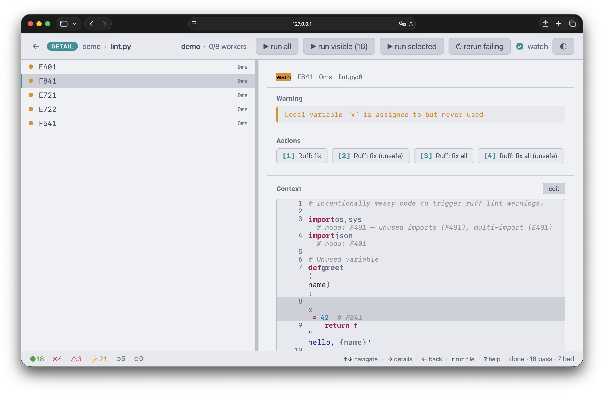

# Frontends

Frontends are the interactive ways you watch a test run unfold: a terminal UI, a browser dashboard, and the editor integrations that embed that dashboard inside VS Code, Positron, and RStudio. All of them consume the same event stream from the engine and stream results in live, so you can browse and drill into failures while tests are still running.

Pick one with `-r` / `--reporter`:

```bash
scrutin                          # TUI (default when the terminal is a tty)
scrutin -r web                   # browser dashboard
scrutin -r web:0.0.0.0:3000      # web on a custom address
```

When no reporter is given, *Scrutin* defaults to `tui` on a tty and `plain` otherwise. The VS Code, Positron, and RStudio integrations are thin wrappers: each one spawns `scrutin -r web` in the background and embeds the resulting page inside the editor.

For non-interactive outputs (plain, JUnit, GitHub Actions, list), see [Reporters](reporters.md).

## Terminal UI

The default frontend. A two-pane, vim-style interface built with ratatui. It launches automatically when your terminal supports it.

The left pane shows your test files. The right pane previews results for the highlighted file. Press `j`/`k` to navigate, `Enter` to drill into a file's test results, and `Esc` to go back.

In detail mode, the left pane shows individual tests within the file, and the right pane shows the failure message and source context for the highlighted test. Press `Enter` on a failing test to see the full error with source code from both the test file and the source function it exercises.

Results stream in live. Press `?` for a help overlay, `/` to filter, `s` to open the sort palette. Watch mode is on by default; disable it with `--set watch.enabled=false`. See [Keybindings](keybindings.md) for the full reference.

## Web dashboard

A browser-based dashboard with live updates. The frontend is embedded in the binary: no Node.js or build step required.

```bash
scrutin -r web                   # binds to 127.0.0.1:7878
scrutin -r web:0.0.0.0:3000      # custom address
```

The dashboard uses server-sent events to stream results as they arrive. It binds to localhost only by default. If the port is busy, *Scrutin* tries the next one automatically.

{ .screenshot }

## VS Code

A TypeScript extension that embeds the *Scrutin* web dashboard in an editor panel and surfaces live pass/fail/error counts in the status bar via SSE.

### Installation

```bash
make vscode     # build + install into VS Code
```

The `scrutin` binary is bundled inside the VSIX, so the extension works out of the box: no separate install needed. If you prefer to use a `scrutin` you've installed yourself (see the [install instructions](getting-started.md#install)), set `scrutin.binaryPath` in settings to point at it, or simply put it on `$PATH` and uninstall the bundled-binary VSIX in favour of the universal one.

The extension activates automatically when it detects `.scrutin/config.toml`, `DESCRIPTION`, or `pyproject.toml` in the workspace.

### Commands

The extension only exposes lifecycle commands. Run / rerun-failing / cancel / toggle-watch are reachable as chip buttons and keyboard shortcuts inside the webview.

| Command | Description |
|---------|-------------|
| `scrutin.start` | Start the *Scrutin* server |
| `scrutin.stop` | Stop the server |
| `scrutin.showPanel` | Show/focus the dashboard panel |

### Settings

| Setting | Default | Description |
|---------|---------|-------------|
| `scrutin.binaryPath` | `""` | Absolute path to the *Scrutin* binary. Leave empty to find it on `$PATH`. |
| `scrutin.autoStart` | `false` | Start the server automatically when the extension activates |

Watch mode and every other *Scrutin* knob are controlled by `.scrutin/config.toml` (per-project) or `~/.config/scrutin/config.toml` (user-level). The extension doesn't override them.

## Positron

The same extension as [VS Code](#vs-code); commands and settings listed above apply unchanged, including the bundled `scrutin` binary. If you prefer to point at your own install, follow the [install instructions](getting-started.md#install) and set `scrutin.binaryPath` in settings. Install with:

```bash
make positron
```

## RStudio

An RStudio add-in that launches the dashboard in the Viewer pane. File navigation uses a FIFO-based bridge that calls `rstudioapi::navigateToFile()`.

### Installation

Install directly from GitHub:

```r
remotes::install_github("vincentarelbundock/scrutin/editors/rstudio")
```

Or build from a local checkout:

```bash
make rstudio    # R CMD INSTALL editors/rstudio
```

Requires: `jsonlite`, `later`, `processx`, `rstudioapi`.

Unlike the VS Code and Positron extensions, the RStudio add-in does **not** bundle the `scrutin` binary. Install it separately (see the [install instructions](getting-started.md#install)) and either ensure it's on `$PATH` or point at it explicitly with `options(scrutin.binary = "/path/to/scrutin")`.

### Usage

```r
scrutin_start()           # start server + show dashboard
scrutin_start(watch = FALSE)
scrutin_stop()            # stop server + cleanup
scrutin_status()          # check if running, show URL + PID
scrutin_show()            # re-show the dashboard in Viewer
```

These are also available from the **Addins** menu in RStudio.
