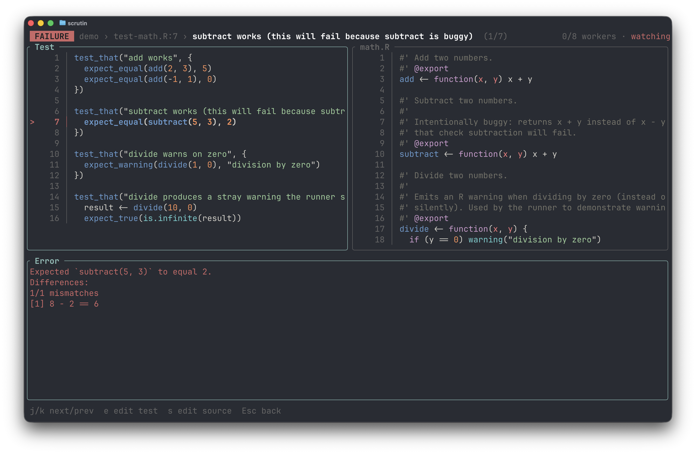

# Terminal UI

The default frontend. A two-pane, vim-style interface built with ratatui. It launches automatically when your terminal supports it.

```bash
scrutin                          # TUI (default when the terminal is a tty)
```

{ .screenshot }

The left pane shows your test files. The right pane previews results for the highlighted file. Press `j`/`k` to navigate, `Enter` to drill into a file's test results, and `Esc` to go back.

In detail mode, the left pane shows individual tests within the file, and the right pane shows the failure message and source context for the highlighted test. Press `Enter` on a failing test to see the full error with source code from both the test file and the source function it exercises.

{ .screenshot }

Results stream in live. Press `?` for a help overlay, `/` to filter, `s` to open the sort palette. Watch mode is on by default; disable it with `--set watch.enabled=false`. See [Keybindings](../keybindings.md) for the full reference.
