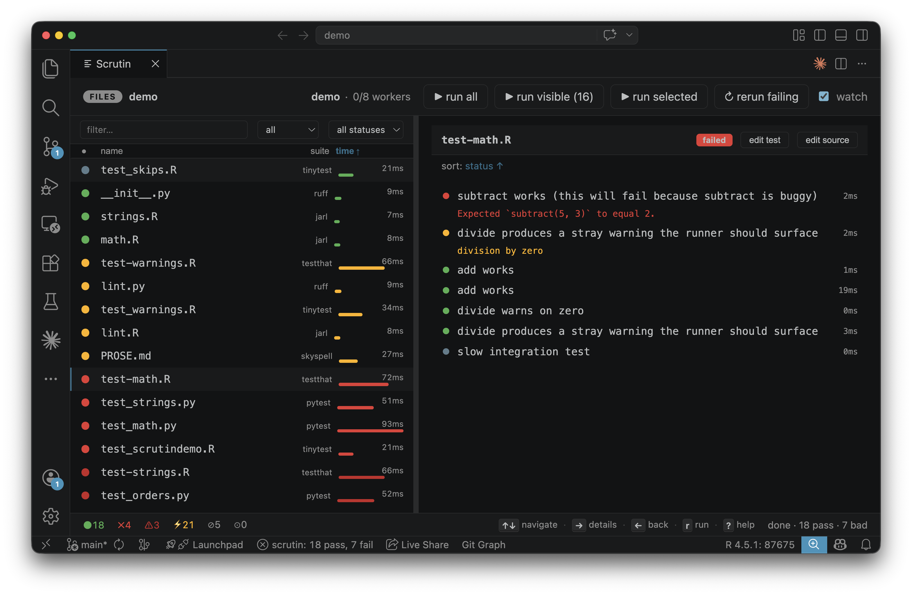

# VS Code

A TypeScript extension that embeds the *Scrutin* web dashboard in an editor panel and surfaces live pass/fail/error counts in the status bar via SSE.

Available on the [VS Code Marketplace](https://marketplace.visualstudio.com/items?itemName=VincentArel-Bundock.scrutin-runner).

{ .screenshot }

## Installation

Install from the [marketplace](https://marketplace.visualstudio.com/items?itemName=VincentArel-Bundock.scrutin-runner), or clone the [GitHub repository](https://github.com/vincentarelbundock/scrutin) and build from source:

```bash
make vscode     # build + install into VS Code
```

The `scrutin` binary is bundled inside the VSIX, so the extension works out of the box: no separate install needed. If you prefer to use a `scrutin` you've installed yourself (see the [install instructions](../getting-started.md#install)), set `scrutin.binaryPath` in settings to point at it, or simply put it on `$PATH` and uninstall the bundled-binary VSIX in favour of the universal one.

The extension activates automatically when it detects `.scrutin/config.toml`, `DESCRIPTION`, or `pyproject.toml` in the workspace.

## Commands

The extension only exposes lifecycle commands. Run / rerun-failing / cancel / toggle-watch are reachable as chip buttons and keyboard shortcuts inside the webview.

| Command | Description |
|---------|-------------|
| `scrutin.start` | Start the *Scrutin* server |
| `scrutin.stop` | Stop the server |
| `scrutin.restart` | Stop and start again |
| `scrutin.showPanel` | Show/focus the dashboard panel |
| `scrutin.init` | Scaffold `.scrutin/config.toml` in the workspace |

## Settings

| Setting | Default | Description |
|---------|---------|-------------|
| `scrutin.binaryPath` | `""` | Absolute path to the *Scrutin* binary. Leave empty to find it on `$PATH`. |
| `scrutin.autoStart` | `false` | Start the server automatically when the extension activates |

Watch mode and every other *Scrutin* knob are controlled by `.scrutin/config.toml` (per-project) or `~/.config/scrutin/config.toml` (user-level). The extension doesn't override them.
