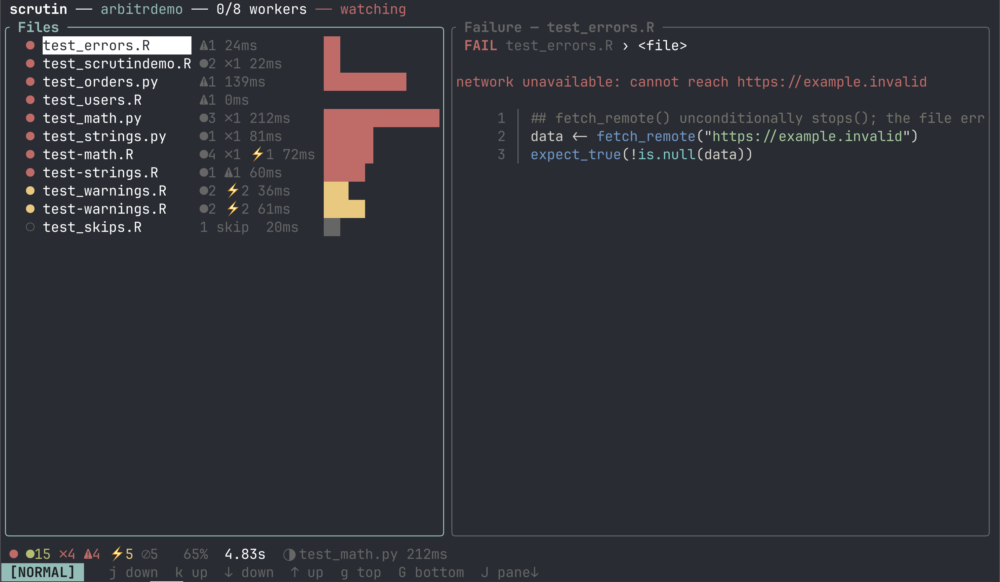

# Getting Started

!!! warning "Alpha software"
    *Scrutin* is alpha software under active development. Expect bugs, breaking changes, and rough edges. Please report issues at [github.com/vincentarelbundock/scrutin](https://github.com/vincentarelbundock/scrutin).

## Install

Prebuilt binaries are published with each [release](https://github.com/vincentarelbundock/scrutin/releases).

=== "macOS / Linux"
    ```bash
    curl --proto '=https' --tlsv1.2 -LsSf \
      https://github.com/vincentarelbundock/scrutin/releases/latest/download/scrutin-installer.sh | sh
    ```

=== "Windows"
    ```powershell
    powershell -ExecutionPolicy Bypass -c \
      "irm https://github.com/vincentarelbundock/scrutin/releases/latest/download/scrutin-installer.ps1 | iex"
    ```

## First run

*Scrutin* can run [in a terminal](frontends.md#terminal-ui), as a [web dashboard](frontends.md#web-dashboard), or [inside an editor](frontends.md#vs-code) like VS Code or RStudio using one of the official extensions. All of these frontends auto-detect your test framework, run every test file in parallel, and stream results as they arrive.

Users interested in a specific frontend should click the links above for setup details. In the simplest case, all you need to do is `cd` to the directory and run:

```bash
scrutin
```

{ .screenshot }

In the terminal UI:

- Each file is one row in the list; the counts bar at the bottom summarizes the run.
- `↑` / `↓` move the cursor
- `→` drills into a file
- `←` goes back
- `r` opens the run menu
- `x` / `X` cancels runs
- `q` quits
- `?` shows the full keymap
- See [Keybindings](keybindings.md) for a full list, including vim-style alternatives.

If no tests are detected, see [Projects and Files](project-discovery.md) for how detection works.

## Configuration

Most projects need no config: auto-detection covers the common cases. When you do want to tune something (workers, timeouts, filters, per-tool options), generate a starter file at the project root:

```bash
scrutin init
```

That writes `.scrutin/config.toml` with commented-out defaults. The full set of knobs is in the [configuration reference](reference/configuration.md).

## External tools

Test frameworks auto-detect; linters and spell-checkers are opt-in so a stray `.py` file in an R project doesn't suddenly start failing on style. Declare the tools you want via `[[suite]]` entries in `.scrutin/config.toml`:

```toml
[[suite]]
tool = "ruff"

[[suite]]
tool = "skyspell"
```

See each tool's page for details: [jarl](tools/jarl.md), [ruff](tools/ruff.md), [skyspell](tools/skyspell.md), [typos](tools/typos.md).

## Requirements

*Scrutin* orchestrates third-party tools but doesn't ship them. Install the ones your project uses through their usual channels:

- **Test and data-validation tools** (testthat, tinytest, pointblank, validate, pytest, Great Expectations) run inside an R or Python interpreter. Install them as importable packages in the environment *Scrutin* uses for that suite (the active R library, or the suite's resolved Python virtualenv).
- **Linters and spell-checkers** (jarl, ruff, skyspell, typos) are standalone binaries. Put them on `PATH`.

At startup *Scrutin* checks that every required binary is reachable and refuses to run a suite whose binary is missing, with a pointer to the tool's homepage. Set `[preflight] command_tools = false` to bypass the check.
