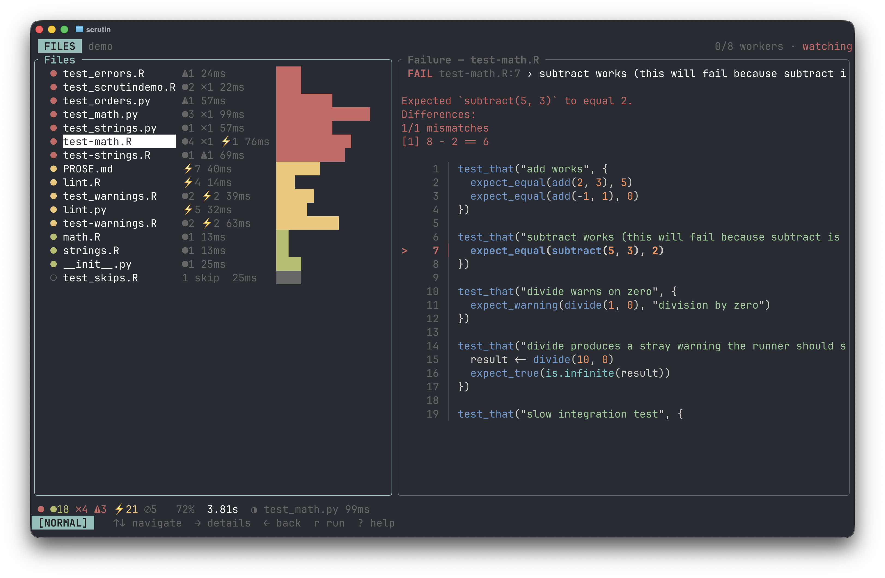

# Getting Started

!!! warning "Alpha software"
    *Scrutin* is alpha software under active development. Expect bugs, breaking changes, and rough edges. Please report issues at [github.com/vincentarelbundock/scrutin](https://github.com/vincentarelbundock/scrutin).

This page assumes the `scrutin` binary is already on `PATH`. If not, head to [Installation](installation.md) first.

## First run

*Scrutin* can run [in a terminal](frontends/terminal-ui.md), as a [web dashboard](frontends/web.md), or [inside an editor](frontends/vscode.md) like VS Code or RStudio using one of the official extensions. All of these frontends auto-detect your test framework, run every test file in parallel, and stream results as they arrive.

Users interested in a specific frontend should click the links above for setup details. In the simplest case, all you need to do is `cd` to the directory and run:

```bash
scrutin
```

{ .screenshot }

In the terminal UI:

- Each file is one row in the list; the counts bar at the bottom summarizes the run.
- `↑` / `↓` move the cursor
- `→` drills into a file
- `←` goes back
- `r` opens the run menu
- `x` / `X` cancels runs
- `q` quits
- `?` shows the full keymap
- See [Keybindings](keybindings.md) for a full list, including vim-style alternatives.

If no tests are detected, see [Projects and Files](project-discovery.md) for how detection works.

## Configuration

Most projects need no config: auto-detection covers the common cases. When you do want to tune something (workers, timeouts, filters, per-tool options), generate a starter file at the project root:

```bash
scrutin init
```

That writes `.scrutin/config.toml` with commented-out defaults, plus one editable runner per detected tool under `.scrutin/runners/<tool>.<ext>` (see [Projects and Files](project-discovery.md#custom-runner-script)). `scrutin init` is idempotent: re-running it prints `<path> already exists, skipping.` for every file it would otherwise overwrite, so it never clobbers local edits. The full set of knobs is in the [configuration reference](reference/configuration.md).

## Opting in to linters and spell checkers

Test frameworks and data-validation tools auto-detect. Linters and spell checkers are opt-in so a stray `.py` file in an R project does not suddenly start failing on style. Declare the tools you want via `[[suite]]` entries in `.scrutin/config.toml`:

```toml
[[suite]]
tool = "ruff"

[[suite]]
tool = "skyspell"
```

See each tool's page for details: [jarl](tools/jarl.md), [ruff](tools/ruff.md), [skyspell](tools/skyspell.md), [typos](tools/typos.md).
