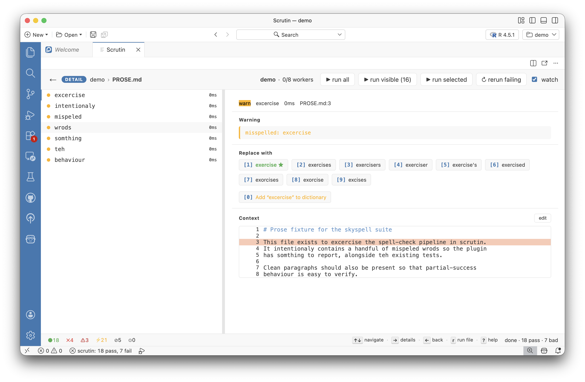
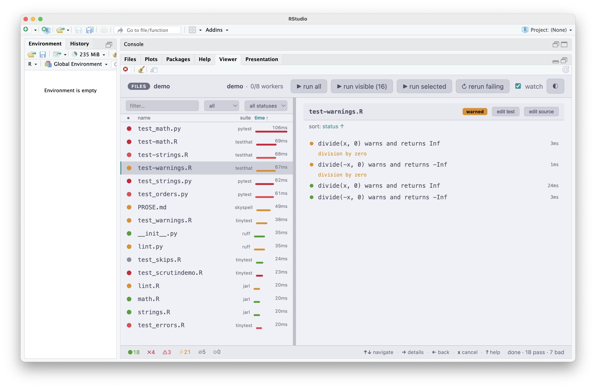

<svg xmlns="http://www.w3.org/2000/svg" width="285" height="87" viewBox="0 0 285.02344 87" role="img" class="hero-logo">
  <title>Scrutin</title>
  <rect x="1" y="1" width="58" height="72" rx="5" ry="5" fill="none" stroke="currentColor" stroke-width="2"/>
  <rect x="11" y="15" width="11" height="11" rx="2" ry="2" fill="none" stroke="currentColor" stroke-width="1.8"/>
  <line x1="29" y1="20.5" x2="51" y2="20.5" stroke="currentColor" stroke-width="1.5" opacity="0.45"/>
  <rect x="11" y="33" width="11" height="11" rx="2" ry="2" fill="currentColor"/>
  <polyline class="hero-check" points="16.5,45.5 20,50 27,42.5" fill="none" stroke-width="1.6" stroke-linecap="round" stroke-linejoin="round" transform="translate(-3,-7)"/>
  <line x1="29" y1="38.5" x2="51" y2="38.5" stroke="currentColor" stroke-width="1.5" opacity="0.45"/>
  <rect x="11" y="51" width="11" height="11" rx="2" ry="2" fill="none" stroke="currentColor" stroke-width="1.8"/>
  <line x1="29" y1="56.5" x2="49" y2="56.5" stroke="currentColor" stroke-width="1.5" opacity="0.45"/>
  <circle cx="55" cy="65" r="16" fill="none" stroke="currentColor" stroke-width="2.5"/>
  <line x1="67" y1="77" x2="79" y2="85" stroke="currentColor" stroke-width="4" stroke-linecap="round"/>
  <text x="93" y="54.2" font-family="Menlo, ui-monospace, SFMono-Regular, monospace" font-size="48" font-weight="500" fill="currentColor" letter-spacing="-1">Scrutin</text>
</svg>

## A Unified Dashboard and Orchestrator for Quality Checks

Unit tests · Data validation · Linting · Spelling

Run every quality check on your project using a single command: unit tests, data validation, linters, spell checkers. *Scrutin* watches for edits, figures out which checks are affected, and re-runs them in parallel. Drill into a failure to see the expected and actual values, as well as the relevant source code. Use quick keystrokes to fix linting and spelling issues, or to open files in your editor of choice.

[Documentation](installation.md){ .md-button .md-button--primary }

<button class="hero-video-poster" data-video="assets/demo.mp4" aria-label="Play demo video">
  
  ▶
</button>

---

## See everything in one place

Pick where to see your results: a live [terminal UI](frontends/terminal-ui.md), a [browser dashboard](frontends/web.md), or embedded inside your editor ([VS Code](frontends/vscode.md), [Positron](frontends/positron.md), or [RStudio](frontends/rstudio.md)). *Scrutin* can also emit [JUnit XML](reporters/junit.md) for CI platforms, [GitHub Actions annotations](reporters/github.md) for pull-request comments, or [plain text](reporters/plain.md) for shell pipelines.

---

## Tools

-   :material-test-tube: **Unit tests**

    ---

    Run your test suites in isolated workers with live result streaming.
    Supports **pytest**, **testthat**, and **tinytest**.

-   :material-database-check: **Data validation**

    ---

    Data quality checks run alongside code quality checks with the same
    outcome taxonomy (pass/fail/warn/skip/error) and rerun logic.
    Supports **pointblank** (R), **validate** (R), and **Great Expectations** (Python).

-   :material-magnify-scan: **Linters**

    ---

    Lint diagnostics map to warnings in the same dashboard; fix actions
    appear as numbered chips in the Detail view so `1`, `2`, `3` invokes
    them directly. Supports **jarl** (R) and **ruff** (Python).

-   :material-spellcheck: **Spell checks**

    ---

    Prose, docs, and comments go through the same engine. Misspellings
    render with ranked suggestions as chips: press `1`-`9` to replace or
    `0` to add the word to a committable project dictionary.
    Supports **skyspell** and **typos**.

---

## Fast, focused, and flexible

**Re-run only what changed.** *Scrutin* watches your project for file changes and uses dependency mapping to figure out which checks are affected. Edit a source file, and only the tests that depend on it re-run.

**Parallel execution.** Within each tool, files run concurrently across isolated workers; one crash never takes down the rest. Opt in to automatic retries (`run.reruns`) and failing-but-passes-on-retry files get flagged as flaky.

**Any mix of tools, side by side.** Test and data-validation tools auto-detect from marker files (`DESCRIPTION`, `pyproject.toml`, ...) the moment you run *Scrutin*. Linters and spell checkers opt in through a one-line `[[suite]]` entry. Every active tool streams into the same dashboard.

---

## In the terminal or in your favorite editor

{ .screenshot }

[**Terminal**](frontends/terminal-ui.md)
{ .screenshot-label }

{ .screenshot }

[**VS Code**](frontends/vscode.md)
{ .screenshot-label }

{ .screenshot }

[**Positron**](frontends/positron.md)
{ .screenshot-label }

{ .screenshot }

[**RStudio**](frontends/rstudio.md)
{ .screenshot-label }

---

## Ship it!

-   :material-package-variant-closed: **Easy to install**

    ---

    Install a single binary. Works on macOS, Linux, and Windows.
    The tools *Scrutin* orchestrates are installed separately, through
    whatever package manager they normally ship with.

-   :material-file-document-outline: **Continuous integration**

    ---

    JUnit XML output for CI platforms. Exit code 0 or 1 for scripts.
    GitHub Actions annotations for inline comments on pull requests.

-   :material-history: **Run history**

    ---

    Every run is saved to a local SQLite database. Track flaky tests,
    spot regressions, and compare run times across commits.

## Etymology

*Scrutin* is French for a ballot or vote: polling individual verdicts
into a collective result, much like this tool polls tests, expectations,
linters, and validators. It comes from the Latin *scrutinium* (a careful
examination), from *scrutari*, "to sift through the rubbish pile".

