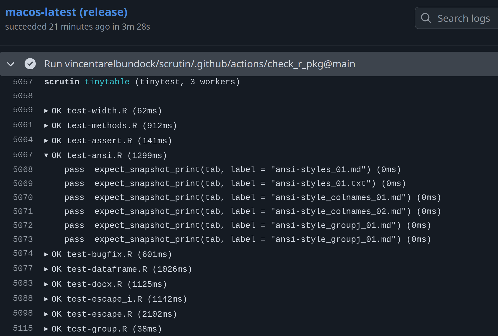

# GitHub Actions

Purpose-built for GitHub Actions CI runs. Streams `::group::` / `::endgroup::` markers per file so the job log has collapsible sections, emits `::error` and `::warning` workflow commands so failures and lint warnings appear as inline annotations on the pull request, and writes a Markdown summary (a pass/fail/error table plus the full failure messages) to `$GITHUB_STEP_SUMMARY` so it renders on the job summary page.

{ .screenshot }

```bash
scrutin -r github
```

Falls back gracefully on non-GitHub runners: the annotations are just echoed into stdout, and the summary write is skipped when the env var is missing.

## Example workflow

A minimal workflow that installs *Scrutin*, sets up R and Python, and runs every detected suite on Linux, macOS, and Windows for each push and pull request:

```yaml
name: tests
on: [push, pull_request]
jobs:
  scrutin:
    strategy:
      fail-fast: false
      matrix:
        os: [ubuntu-latest, macos-latest, windows-latest]
    runs-on: ${{ matrix.os }}
    steps:
      - uses: actions/checkout@v4
      - uses: r-lib/actions/setup-r@v2          # drop if R-free
      - uses: actions/setup-python@v5           # drop if Python-free
        with:
          python-version: "3.12"
      - name: Install scrutin
        run: cargo install scrutin
      - name: Run tests
        run: scrutin -r github
```

Every GitHub-hosted runner image (`ubuntu-latest`, `macos-latest`, `windows-latest`) ships with a working Rust toolchain pre-installed, so `cargo install scrutin` works on all three without a separate setup action. Compiling from source on every job is slow, so for larger matrices consider caching Cargo state with `Swatinem/rust-cache` or installing a prebuilt binary via `taiki-e/install-action`.

Drop the `setup-r` step on Python-only projects and the `setup-python` step on R-only projects. Add a separate `scrutin -r junit:report.xml` step if you also want a JUnit artifact to upload with `actions/upload-artifact`.

## Bundled composite actions

The scrutin repository ships four composite actions under `.github/actions/` that you can reuse in your own workflows. Reference them as `vincentarelbundock/scrutin/.github/actions/<name>@<ref>`. Pin `<ref>` to a release tag (e.g. `v0.0.7`) rather than `main` so updates to scrutin's CI do not silently change your own.

| Action | What it does |
|--------|--------------|
| `install_scrutin` | Downloads the latest scrutin release binary via the official installer (much faster than `cargo install scrutin` on every job). Works on Linux, macOS, and Windows runners. |
| `install_r` | Installs R and your package's dependencies. On Linux it uses [r-ci / r2u](https://eddelbuettel.github.io/r-ci/) for binary apt-based package installs (fast cold-start); on macOS and Windows it falls back to `r-lib/actions`. |
| `install_python` | Installs `uv` and a pinned Python version. Optionally runs `uv sync` in a working directory. |
| `check_r_pkg` | Runs `R CMD check` with `--no-tests --as-cran`, then runs the package's tests via scrutin. The split is the point: `R CMD check` validates docs, examples, vignettes, and CRAN policy without re-running tests (which the check would otherwise run with R's default reporter, producing slow, unstructured output). scrutin then runs the tests separately with the `-r github` reporter so failures surface as PR annotations. |

## Larger example: R package + Python module in one repo

The workflow below reuses the bundled actions to check an R package on three operating systems and, in parallel, run the Python test suite on Linux. No hand-rolled Rust toolchain step, no duplicate test execution inside `R CMD check`, and every failure is surfaced as an inline PR annotation through `-r github`.

```yaml
name: tests
on: [push, pull_request]

jobs:
  check-r:
    name: R CMD check + scrutin (${{ matrix.os }})
    strategy:
      fail-fast: false
      matrix:
        os: [ubuntu-latest, macos-latest, windows-latest]
    runs-on: ${{ matrix.os }}
    steps:
      - uses: actions/checkout@v4
      - uses: vincentarelbundock/scrutin/.github/actions/check_r_pkg@v0.0.7
        with:
          r-version: release
          # `check_r_pkg` defaults to `-r github`. Override for a JUnit sidecar:
          # reporter: junit:report.xml

  test-python:
    name: pytest via scrutin
    runs-on: ubuntu-latest
    steps:
      - uses: actions/checkout@v4
      - uses: vincentarelbundock/scrutin/.github/actions/install_python@v0.0.7
        with:
          python-version: "3.12"
          sync: "true"                  # runs `uv sync` so pytest sees the project
      - uses: vincentarelbundock/scrutin/.github/actions/install_scrutin@v0.0.7
      - name: Run Python tests
        run: scrutin -r github --set run.tool=pytest
```

A few details worth flagging:

- **`check_r_pkg` is the headline piece.** Its default `check-args` include `--no-tests`, so `R CMD check` validates the package's static properties (docs, examples, vignettes, CRAN policy, `NAMESPACE`, `NEWS.md`) and then the action hands off to scrutin for the actual test run. This avoids executing your tests twice (once under R's terse built-in reporter inside `R CMD check`, and again under scrutin's per-file parallel runner) and keeps the test failures in a machine-consumable format.
- **`install_python` with `sync: "true"`** runs `uv sync` in the working directory so your project's dependencies resolve before pytest starts. Set `sync: "false"` (the default) if you only need `uv` and a bare interpreter.
- **`--set run.tool=pytest`** restricts scrutin to the pytest suite in the Python job, so it does not try to run any R tools that happen to be auto-detected in the repo. Drop it for a monoglot project.
- **Parallel jobs, not one matrix.** Splitting R and Python into separate jobs lets them fail independently and shortens the critical path on a PR. Matrix-ing one job across OS × language grows the cell count quickly without adding coverage.
